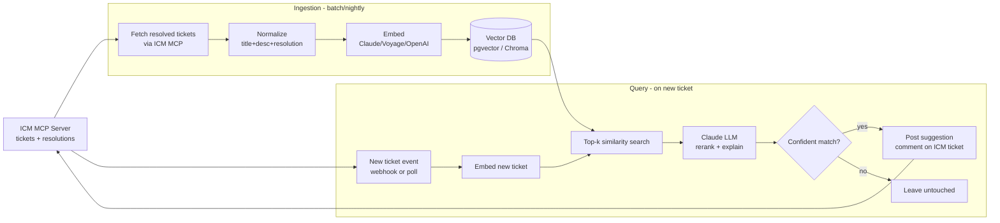

# Ticket Duplicate-Detection Bot — Architecture

Goal: when a new support ticket arrives, find past resolved tickets that look
like it, surface the prior fix, and let the on-call engineer decide.

Assumption: an **ICM MCP server** is available and exposes tools like
`list_tickets`, `get_ticket`, `search_tickets` — this is our source of truth
for ticket data.

---

## 1. High-level flow



---

## 2. Components

| Component | Responsibility | Tech choice |
|---|---|---|
| **ICM MCP client** | Pulls ticket data, posts comments back | existing MCP server |
| **Ingestion worker** | Nightly/periodic sync of resolved tickets | Python/Node cron job |
| **Embedding model** | Turns ticket text into vectors | `voyage-3` or `text-embedding-3-large` |
| **Vector store** | Stores embeddings + metadata (id, status, fix) | `pgvector` (simplest) or Chroma |
| **Matcher** | k-NN search (k=5), cosine similarity | built into the vector DB |
| **Reranker / explainer** | Decides if top matches are truly duplicates and drafts a reply | Claude Sonnet 4.6 |
| **Dispatcher** | Writes the suggestion back via ICM MCP | same MCP client |

---

## 3. Data shape stored per ticket

```json
{
  "ticket_id": "ICM-12345",
  "title": "API 500 on /orders under load",
  "description": "...",
  "resolution": "bumped pool size in config; see PR #901",
  "tags": ["api", "orders", "perf"],
  "resolved_at": "2026-03-10",
  "embedding": [0.012, -0.44, ...]
}
```

Embed `title + "\n" + description + "\n" + resolution` as one chunk — the
resolution text is what makes retrieval actually useful (you find tickets
fixed the same way, not just worded the same way).

---

## 4. Query path in detail

1. New ticket arrives (webhook from ICM, or poll every N minutes).
2. Embed `title + description` (no resolution — we don't have one yet).
3. Vector DB returns top-5 past tickets with similarity scores.
4. Claude is prompted with: *"Here is a new ticket. Here are 5 past
   resolved tickets. For each, say whether it's likely the same root cause.
   If any score high, draft a 3-line comment citing ticket IDs and the fix."*
5. If Claude's confidence is above a threshold (e.g. it marks at least one
   match as "likely same root cause"), post a comment on the ICM ticket:

   > Possible duplicate of **ICM-12345** (fixed 2026-03-10 by bumping pool
   > size). Also similar: ICM-11987, ICM-12002.

6. Otherwise stay silent — false positives are worse than silence here.

---

## 5. Why this shape (vs. alternatives)

- **RAG over fine-tuning**: 1k tickets is way below the data needed to
  fine-tune a duplicate classifier. Embeddings + retrieval get you 90% of
  the value with zero training.
- **LLM reranker on top of vector search**: pure cosine similarity finds
  lexically similar tickets but misses semantic duplicates (and vice-versa).
  The LLM step filters out "sounds similar but different root cause."
- **Comment, don't auto-close**: the bot suggests; humans decide. Auto-merge
  of duplicates erodes trust the first time it's wrong.

---

## 6. Rollout phases

1. **Phase 1 — read-only**: ingest + retrieve, dump matches to a Slack
   channel for the on-call to eyeball. Tune threshold.
2. **Phase 2 — comment**: post suggestions directly on ICM tickets.
3. **Phase 3 — feedback loop**: capture thumbs-up/down on suggestions,
   use them to tune threshold and, eventually, fine-tune the embedder.
```
